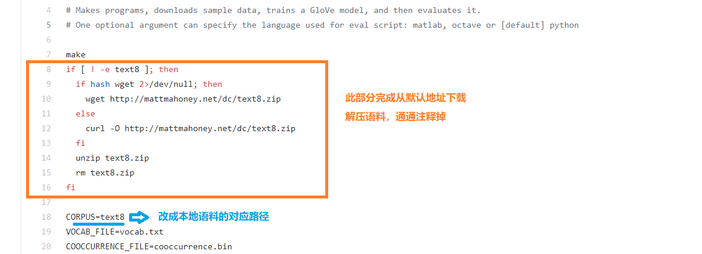
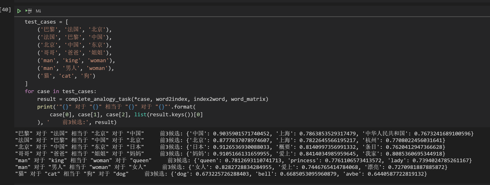

# GloVe word-embedding From Chinese Wiki corpus

## 杂谈

准备第二个实验时，发现 [FastText](https://github.com/facebookresearch/fastText/blob/master/docs/pretrained-vectors.md) 预训练的中文词向量，在最后一个任务——词语类比任务（Word Analogy Task，即 “a对于b相当于c对于____”）结果展示上表现不佳，会跑出不合理的结果。另一方面，GloVe 在词语类比上优势明显（see CS224n），在网上找有没公开的训练好的中文 GloVe 词向量，没找到。

[GloVe 官网](https://nlp.stanford.edu/projects/glove/) 提供可下载的预训练词向量都是英文的，中文词向量需要自己下语料库训练。下面给出维基中文语料下载训练过程。

## 环境

* Ubuntu 9.3.0-17ubuntu1~20.04
* Python 3.7.6

## 过程

### zhwiki

维基语料下载网页见 [zhwiki](https://dumps.wikimedia.org/zhwiki/)，它每个月会更新一两次。下载使用前需要先解析抽取、繁体简化一下，处理完成后你将得到维基百科简体中文原始数据。详细处理过程见

* [ChineseWiki](https://github.com/Yudreamy/GloVe_Chinese_word_embedding/blob/master/ChineseWiki.md)

### 文本处理

此处需要进一步文本处理，包括去除符号、停用词、无关内容，分词。停用词数据来自 [zlsdu/Word-Embedding](https://github.com/zlsdu/Word-Embedding#3%E5%AE%9E%E9%AA%8C%E6%95%B0%E6%8D%AE%E7%AE%80%E4%BB%8B)，分词用任一现有分词工具即可。

### GloVe 词向量训练

我们需要下载 GloVe 官方代码来训练本地数据集对应的中文词向量。

* 下载解压 [GloVe 官方源码](https://github.com/stanfordnlp/GloVe)
* 将经过文本处理后的维基中文语料放到解压后的主目录下
* 修改 demo.sh 文件中的两个地方，如下图

* 在主目录下执行 `make` 编译
* 在主目录下执行 `bash demo.sh` 开始训练 

> tips: zhwiki 数据集较大，训练时间相对较长（almost 2h+），可用 tmux 或 nohup

### 结果文件

训练成功后，即可得到词向量模型（vectors.txt；二进制格式 vectors.bin）和词表文件（vocab.txt），我会把这三个文件放到百度云盘上，地址：[zhwiki](https://pan.baidu.com/s/1spUiHXVSxebbOHmfn1MiJw)，提取码：jm32。

此外，模型训练的词向量为 50 维（具体参数你可以在 demo.sh 文件中调整），词表大小 83W+，可参照训练过程输出文件 `output.txt`，直接给在当前主目录下。

## check

最后加载模型检查一下效果，抽几个词语类比的小栗子

还会翻译呢 :joy:

## References

- [x] [opencc-python Github](https://github.com/yichen0831/opencc-python)
- [ ] [mattzheng/ChineseWiki 维基百科中文词条](https://github.com/mattzheng/ChineseWiki/blob/master/README.md)
- [x] [中文维基百科下载地址](https://dumps.wikimedia.org/zhwiki/)
- [ ] [stanfordnlp/GloVe 官网](https://github.com/stanfordnlp/GloVe)
- [x] [zlsdu/Word-Embedding](https://github.com/zlsdu/Word-Embedding)

